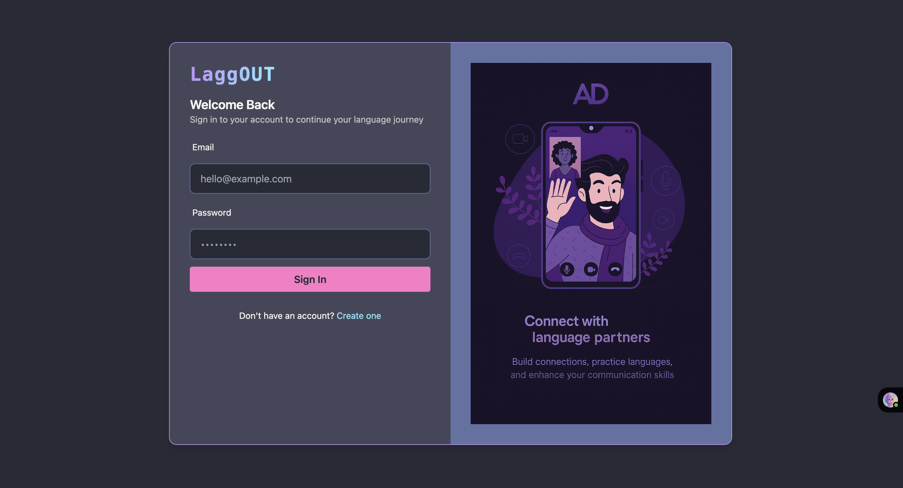
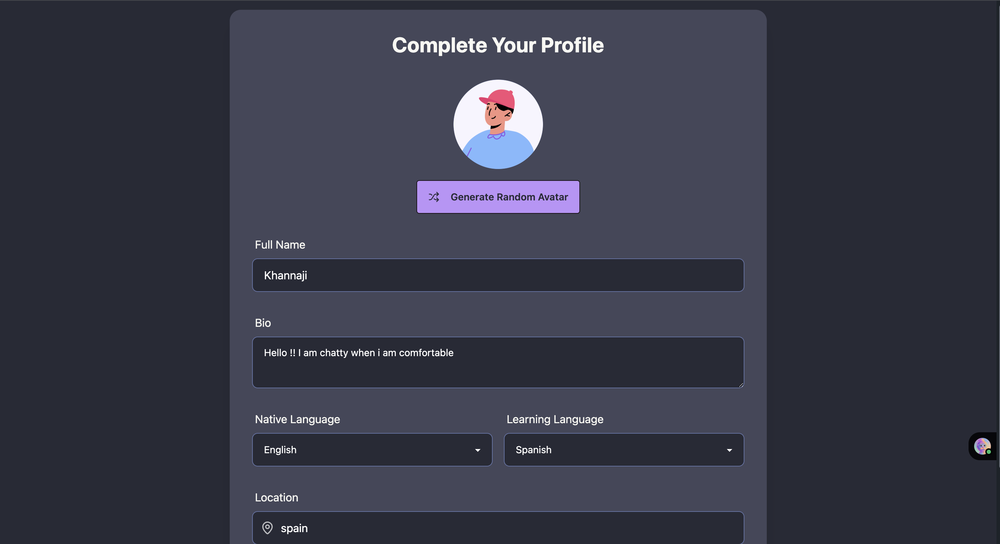
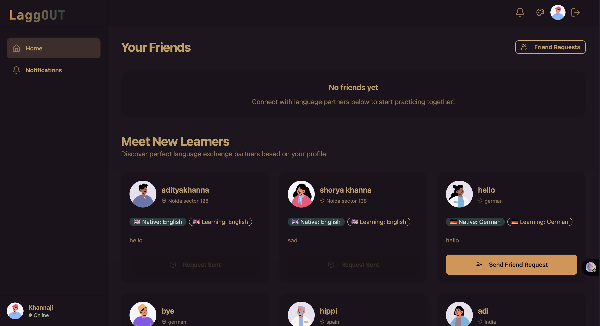
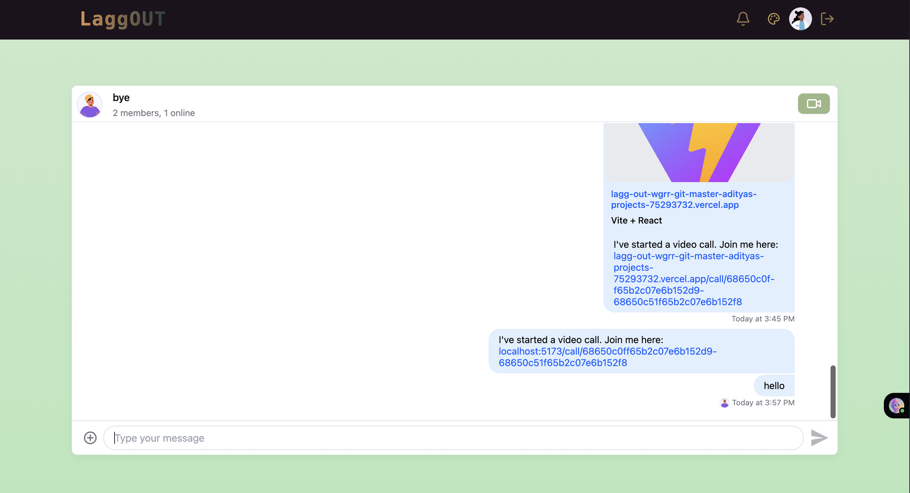
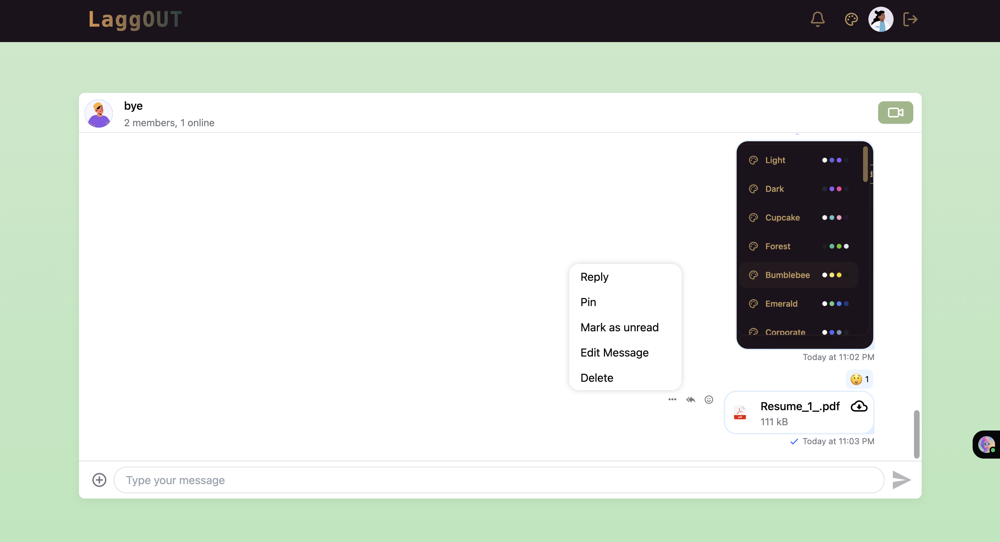
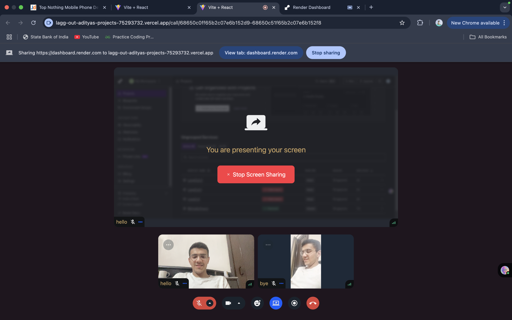

# LaggOut 🎥💬

A full-stack real-time video calling and chat application built using **MERN stack**, **Stream Video SDK**, and **JWT authentication**. Designed for seamless communication, it supports one-on-one messaging, friend requests, onboarding, and secure video calls — with responsive UI and production-ready deployment on **Render** (backend) and **Vercel** (frontend).

---

## 🔗 Live Demo

- **Frontend**: [https://lagg-out-adityas-projects-75293732.vercel.app](https://lagg-out-adityas-projects-75293732.vercel.app)  
- **Backend**: [https://laggout-2.onrender.com](https://laggout-2.onrender.com)

---

## 🛠️ Tech Stack

### 🔹 Frontend
- React + Vite
- Tailwind CSS
- React Router
- Axios + React Query
- Stream Video SDK
- Toast Notifications

### 🔹 Backend
- Node.js + Express.js
- MongoDB + Mongoose
- JWT Auth (via Cookies)
- Stream Chat & Video API
- CORS & Cookie-parser

---

## 📦 Features

- 🔐 User Authentication (Signup/Login with hashed passwords + JWT in cookies)
- 👤 Onboarding with bio, location, and language selection
- 📡 Real-Time Video Calling using Stream SDK
- 💬 Friend Requests (send, accept, view incoming/outgoing)
- 🔎 Recommended Users (users not yet connected)
- 🌐 CORS setup for Vercel + localhost
- 🍪 Cookies-based authentication for persistent login
- 📱 Responsive UI across all screen sizes

---

## ⚙️ Setup Instructions

### 1. Clone the Repo

```bash
git clone https://github.com/ADITYA-0208/LaggOut.git
cd LaggOut
````

### 2. Environment Variables

#### 🌍 Backend (`/backend/.env`)

```env
PORT=5001
MONGO_URI=your_mongodb_uri
JWT_SECRET_KEY=your_jwt_secret
STREAM_API_KEY=your_stream_key
STREAM_API_SECRET=your_stream_secret
NODE_ENV=development
```

#### 💻 Frontend (`/frontend/.env`)

```env
VITE_STREAM_API_KEY=your_stream_key
```

### 3. Run Locally

#### 🚀 Backend

```bash
cd backend
npm install
npm run dev
```

#### 💻 Frontend

```bash
cd frontend
npm install
npm run dev
```

---

## 🚀 Deployment

* **Frontend**: Vercel (`frontend/vercel.json` configured for proxy)
* **Backend**: Render (Node web service with `start` command: `node src/server.js`, root: `backend`)

Make sure your backend is CORS-configured to allow:


## 📸 Screenshots
### 🧾 Login Page


### SignUP Page


### Overborading Page


### Home Page


### Notification


### ChatAPP1 


### ChatAPP2


### Video_Call_Present_Screen



---

## 🙋‍♂️ Author

**Aditya Khanna**
[GitHub](https://github.com/ADITYA-0208) • [LinkedIn](https://www.linkedin.com/in/adityavardhankhanna)

---

## 📃 License

This project is licensed under the [MIT License](LICENSE).
