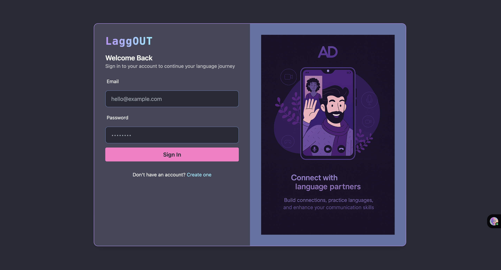
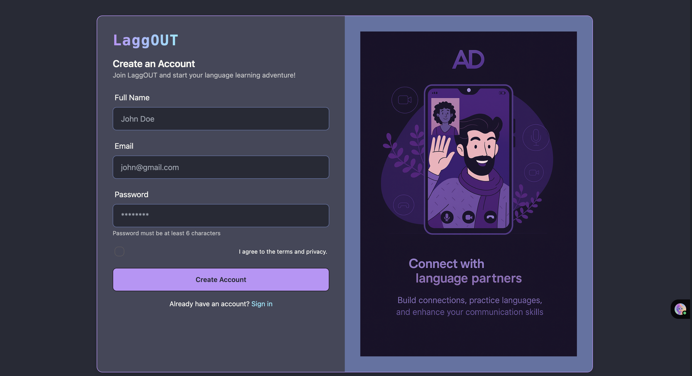
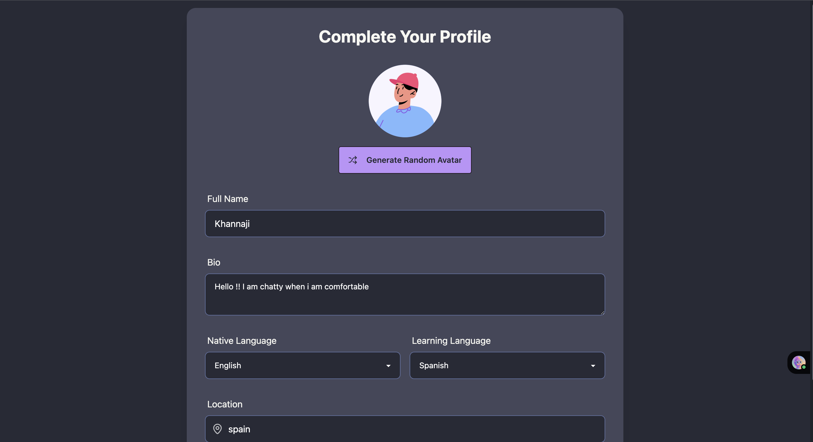
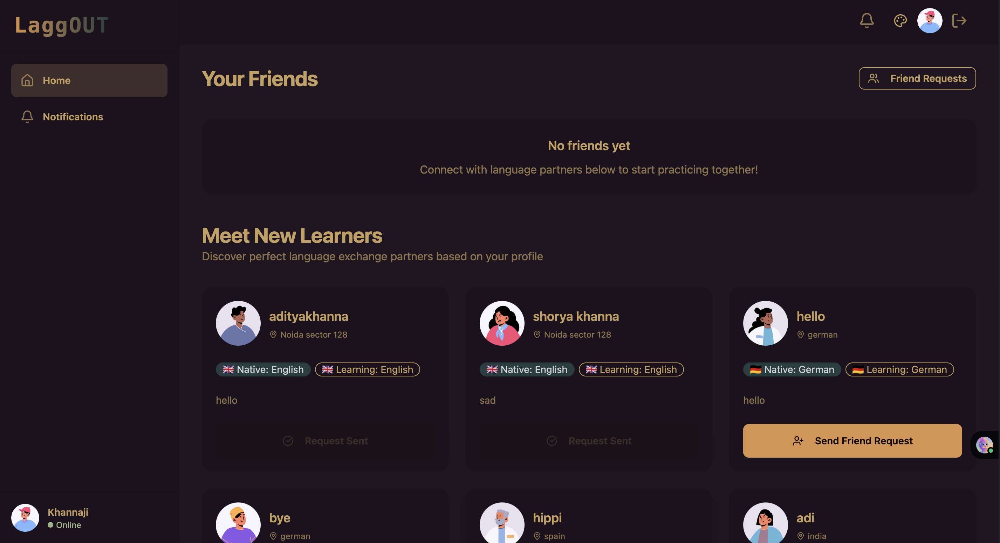
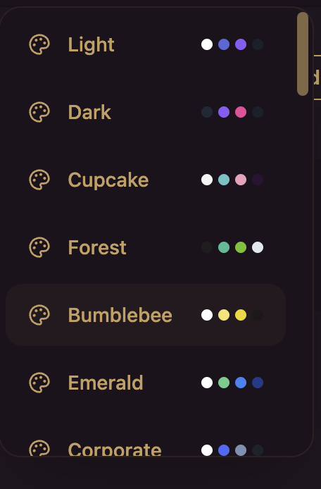
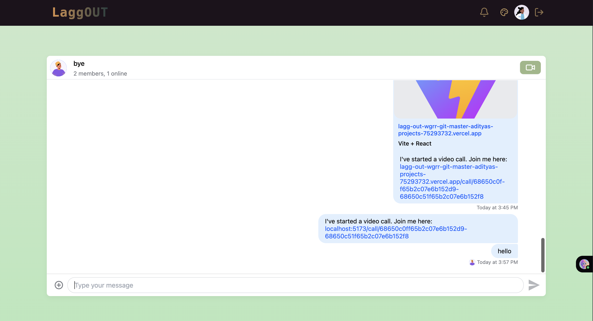
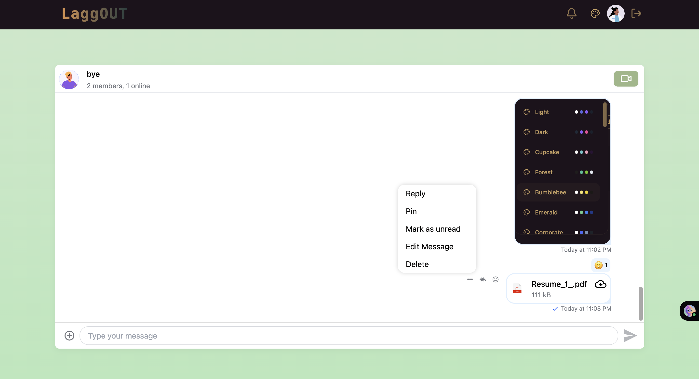

# LaggOut 🎥💬

A full-stack real-time video calling and chat application built using **MERN stack**, **Stream Video SDK**, and **JWT authentication**. Designed for seamless communication, it supports one-on-one messaging, friend requests, onboarding, and secure video calls — with responsive UI and production-ready deployment on **Render** (backend) and **Vercel** (frontend).

---

## 🔗 Live Demo

- **Frontend**: [https://lagg-out-adityas-projects-75293732.vercel.app](https://lagg-out-adityas-projects-75293732.vercel.app)  
- **Backend**: [https://laggout-2.onrender.com](https://laggout-2.onrender.com)

---

## 🛠️ Tech Stack

### 🔹 Frontend
- React + Vite
- Tailwind CSS
- React Router
- Axios + React Query
- Stream Video SDK
- Toast Notifications

### 🔹 Backend
- Node.js + Express.js
- MongoDB + Mongoose
- JWT Auth (via Cookies)
- Stream Chat & Video API
- CORS & Cookie-parser

---

## 📦 Features

- 🔐 User Authentication (Signup/Login with hashed passwords + JWT in cookies)
- 👤 Onboarding with bio, location, and language selection
- 📡 Real-Time Video Calling using Stream SDK
- 💬 Friend Requests (send, accept, view incoming/outgoing)
- 🔎 Recommended Users (users not yet connected)
- 🌐 CORS setup for Vercel + localhost
- 🍪 Cookies-based authentication for persistent login
- 📱 Responsive UI across all screen sizes

---

## ⚙️ Setup Instructions

### 1. Clone the Repo

git clone https://github.com/ADITYA-0208/LaggOut.git
cd LaggOut

3. Run Locally
      🚀 Backend
      
            cd backend
            npm install
            npm run dev
      💻 Frontend
      
            cd frontend
            npm install
            npm run dev

### 🧾 Login Page

### 🧾 Signup Page

### 🧾 Overboarding Page

### 🧾 Home Page

### 🧾 Themes Page

### 🧾 ChatAPP Page

### 🧾 Chatapp Page

